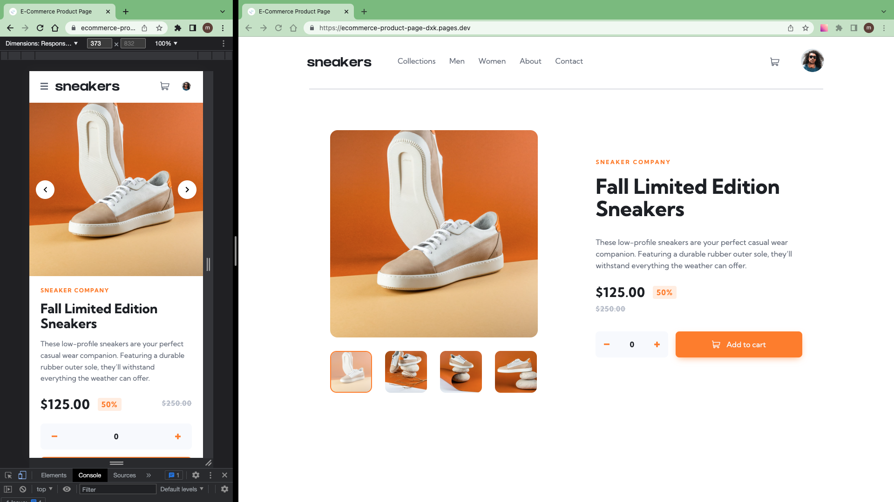

# Frontend Mentor - E-commerce product page solution

This is a solution to the [E-commerce product page challenge on Frontend Mentor](https://www.frontendmentor.io/challenges/ecommerce-product-page-UPsZ9MJp6)

## Table of contents

- [Overview](#overview)
  - [The challenge](#the-challenge)
  - [Screenshot](#screenshot)
  - [Links](#links)
- [My process](#my-process)
  - [Built with](#built-with)
  - [What I learned](#what-i-learned)
  - [Continued development](#continued-development)
  - [Useful resources](#useful-resources)
- [Author](#author)
- [Acknowledgments](#acknowledgments)

## Overview

### The challenge

Users should be able to:

- View the optimal layout for the site depending on their device's screen size
- See hover states for all interactive elements on the page
- Open a lightbox gallery by clicking on the large product image
- Switch the large product image by clicking on the small thumbnail images
- Add items to the cart
- View the cart and remove items from it

### Screenshot

### Links

- Solution: [frontendmentor.io](https://www.frontendmentor.io/solutions/ecommerce-product-page-CSf8kgfCAY)

- Live Site: [cloudflare](https://ecommerce-product-page-dxk.pages.dev/)

## My process

- Install React+Vite, Prepare assets, Initial git
- Identify components (These components may change during creation)
  - Layout
    - Wrapper
  - Header
  - Menu
  - Cart
  - Product (page)
  - Slider (fade)
  - ProductSlider
  - Modal
  - Backdrop
  - LightBox (with slider capability)
  - ProductLightBox
- Create components
- Work on:
  - Mobile design based on `design` folder (375px)
  - bigger reselotion based on `design` folder (>375px)

### Built with

- React
- Framer Motion
- CSS Module
- Mobile first workflow

### What I learned

Reusability thought in react is the crucial part of react, Knowing how to play with that is more crucial.

### Continued development

more on React and Framer motion

### Useful resources

- [Framer Motion Image Gallery](https://codesandbox.io/s/framer-motion-image-gallery-pqvx3)

- [React Easy Slider with Framer Motion Tutorial](https://www.youtube.com/watch?v=W0bEL93tt4k)

- [Animate Menu](https://www.framer.com/motion/examples/#variants)

## Author

- Frontend Mentor - [@siavhnz](https://www.frontendmentor.io/profile/siavhnz)

- github - [@siavhnz](https://www.github.com/siavhnz)

## Acknowledgments

Thanks To

[Frontendmentor.io](https://www.frontendmentor.io/challenges) - for their Excitement challenges  

[Perfect Pixel](https://chrome.google.com/webstore/detail/perfectpixel-by-welldonec/dkaagdgjmgdmbnecmcefdhjekcoceebi?hl=en) - for such a great extension
